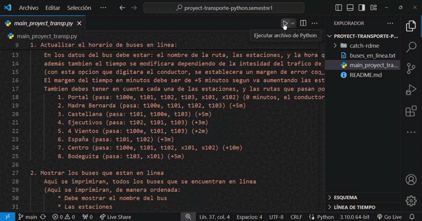
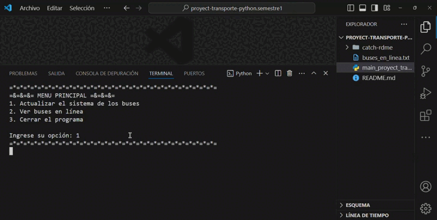

# Proyecto Transporte: Control del Horario del Sistema Urbano de Cartagena

Este proyecto fue uno de mis primeros proyectos que presenté en el primer semestre utilizando algoritmos de Python, y con estudios previos en Python básico. Consiste en un algoritmo para gestionar el horario del sistema urbano de transporte de la ciudad de Cartagena, específicamente para Transcaribe. El objetivo es proporcionar una herramienta para que los conductores actualicen y consulten la información de los buses en línea.

## Características

1. **Actualizar el Horario de Buses**: 
   - Agregar un nuevo bus.
   - Eliminar un bus cuando haya finalizado su recorrido.
   - Vaciar todos los datos.
  
2. **Mostrar Buses en Línea**: 
   - Imprimir todos los buses disponibles junto con sus respectivas estaciones y horarios.

3. **Cerrar el Programa**: 
   - Guardar los datos actuales en un archivo y salir del sistema.

<div align="center"> 
  
</div>

## Estructura del Programa

El programa está estructurado en un menú principal con las siguientes opciones:

- **Actualizar el sistema de los buses**
  - Agregar bus
  - Eliminar bus en línea

- **Ver buses en línea**
  - Listar buses con estaciones y horas

- **Cerrar el programa**
  - Guardar datos y salir

<div align="center"> 
  
</div>

## Consideraciones

- La carpeta `catch-rdme` y los GIFs incluidos no tienen relación con el algoritmo, son para fines de presentacion del readme.

## Cómo ejecutar este archivo

1. Clona este repositorio en tu máquina local.
2. Ejecuta el archivo `transporte.py` usando Python.
3. Sigue las instrucciones en pantalla para gestionar los buses.

### Ejemplo de uso:
```bash
python transporte.py
```

### Sugerencias :D
- Puedes asegurarte de adaptar el nombre del archivo si tu script tiene un nombre diferente.
- Agrega más detalles sobre cómo instalar Python o ejecutar el programa si lo consideras necesario.
- Ademas cualquier sugerencia siempre estoy pendiente en pequeños cambios

Muchas gracias
